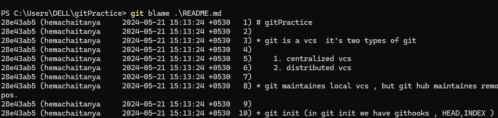
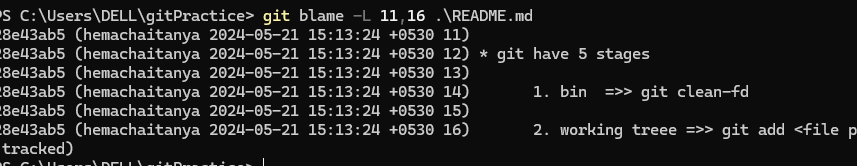

# gitPractice

* git is a vcs  it's two types of git

    1. centralized vcs
    2. distributed vcs
 
* git maintaines local vcs , but git hub maintaines remort repos.

* git init (in git init we have githooks , HEAD,INDEX )

* git have 5 stages
  
      1. bin  =>> git clean-fd
  
      2. working treee =>> git add <file path> (untracked files to tracked)

      3. staging area ==>> git commit -m "add changes" (tracked files will be stores in local repo)
  
      4. local repo ==>> git pull (all local repo files will be pushed to remort repo)
  
      5. remort repo
  
  
     
     git branch branch-name
    
     git checkout -b branch name
    
     git branch -m oldname new name

## git squash

* to merge the 2 commits  into one

## git merge

when we change only in the future branch , we cannot change in the main branches we should follow the bellow two methods 

  1. fastforword merge
  2. un fost-forworded

### git fastforword merge : 

* head shows the latest commit in new feature branch

* git checkout <master>

* git merge <feature>

### git un fost-forworded

* head shows the last commit in the main branch

*  git checkout <master>

* git merge feature --noff

Incase we can change the both main branch and feature branch , we use the 3 ways to merge the code in to main branch

    

### 3 way merge 

*  this merge will be done only in main branch & feature and main branch changes forms some extra commit is called 3 way merge

* git checkout master

* git merge feature

### git rebase 

* inthese case we merge the code in both branches eaither in feature or main branch

* git checout master (or) feature

* git merge feature (or) master

* it have 2 parents , and after merge the commit ids will be changes

### difference b/w git init ,git clone

* git init: creates new repository , it create .git folder and metadata dependencies

    --bare

* Creates a bare repository. it does not containes working directory 
    

    --template=path

* Specifies the directory from which templates will be used

    --quite

    
* Only prints "critical level" messages, Errors, and Warnings. All other output is silenced

     --separate-git-dir 
     
* on an existing repository and the .git dir will be moved to the specified  path.

* git clone : copy of  existing git repository

## git blame <filename>

* it shows the all commits history  across rename and copies for all commit messages

#### git blame -L 10,15 (for specific lines)

#### git blame 

* git blame -L 11,16 .\README.md

* git blame -R .\README.md

* git blame -M .\README.md

#### git fork and clone

* git fork is copy of remort to remort repos , but git clone have copy of remort to local 

* clone have only one central repo , fork have two individual central repos

### git log --log-size (or) git log --oneline --log-size

* it shows commit msg size also

#### git commit -m --allow-empty " "

[referhere](https://www.atlassian.com/git/tutorials/rewriting-history/git-rebase)

[refer-git-complete-documentation](https://www.atlassian.com/git/tutorials/undoing-changes/git-revert)

  
