0

Cover image for GitHub - 30 GitHub commands used by every DevOps Engineer
ProDevOpsGuy Tech Community profile imageH A R S H H A A
H A R S H H A A for ProDevOpsGuy Tech Community
Posted on Jul 17

2
GitHub - 30 GitHub commands used by every DevOps Engineer
#
git
#
devops
#
github
#
cli
Introduction:
Git & GitHub has steadily risen from being just a preferred skill to a must-have skill for multiple job roles today. In this article, I will talk about the Top 30 Git Commands that you will be using frequently while you are working with Git.

🌐 Essential GitHub Commands Every DevOps Engineer Should Know
1. git init
🛠️ Description: Initializes a new Git repository in the current directory.

2. git clone [url]
🛠️ Description: Clones a repository into a new directory.

3. git add [file]
🛠️ Description: Adds a file or changes in a file to the staging area.

4. git commit -m "[message]"
🛠️ Description: Records changes to the repository with a descriptive message.

5. git push
🛠️ Description: Uploads local repository content to a remote repository.

6. git pull
🛠️ Description: Fetches changes from the remote repository and merges them into the local branch.

7. git status
🛠️ Description: Displays the status of the working directory and staging area.

8. git branch
🛠️ Description: Lists all local branches in the current repository.

9. git checkout [branch]
🛠️ Description: Switches to the specified branch.

10. git merge [branch]
🛠️ Description: Merges the specified branch's history into the current branch.

11. git remote -v
🛠️ Description: Lists the remote repositories along with their URLs.

12. git log
🛠️ Description: Displays commit logs.

13. git reset [file]
🛠️ Description: Unstages the file, but preserves its contents.

14. git rm [file]
🛠️ Description: Deletes the file from the working directory and stages the deletion.

15. git stash
🛠️ Description: Temporarily shelves (or stashes) changes that haven't been committed.

16. git tag [tagname]
🛠️ Description: Creates a lightweight tag pointing to the current commit.

17. git fetch [remote]
🛠️ Description: Downloads objects and refs from another repository.

18. git merge --abort
🛠️ Description: Aborts the current conflict resolution process, and tries to reconstruct the pre-merge state.

19. git rebase [branch]
🛠️ Description: Reapplies commits on top of another base tip, often used to integrate changes from one branch onto another cleanly.

20. git config --global user.name "[name]" and git config --global user.email "[email]"
🛠️ Description: Sets the name and email to be used with your commits.

21. git diff
🛠️ Description: Shows changes between commits, commit and working tree, etc.

22. git remote add [name] [url]
🛠️ Description: Adds a new remote repository.

23. git remote remove [name]
🛠️ Description: Removes a remote repository.

24. git checkout -b [branch]
🛠️ Description: Creates a new branch and switches to it.

25. git branch -d [branch]
🛠️ Description: Deletes the specified branch.

26. git push --tags
🛠️ Description: Pushes all tags to the remote repository.

27. git cherry-pick [commit]
🛠️ Description: Picks a commit from another branch and applies it to the current branch.

28. git fetch --prune
🛠️ Description: Prunes remote tracking branches no longer on the remote.

29. git clean -df
🛠️ Description: Removes untracked files and directories from the working directory.

30. git submodule update --init --recursive
🛠️ Description: Initializes and updates submodules recursively.
## VCS
    two types of vcs are present
    (1) centralized: SVN , CVS , perforces ,TFS  etc...
    (2) distributed: git , mercurial ,fossil
        * no single point of failure , every developer  has local repository .
        * performanc eis more
        * wihout network also developer contines his work , 
### Git: global information trader
 * git is a distributed  vcs , git is developed by 'linus torvalds'

### branching stratagy

    The git flow branching strategy is very effective branching strategy for the projects. If the project under development needs to support the older releases made then the git flow can be extended with support branches For the support branches i have found useful resource
    
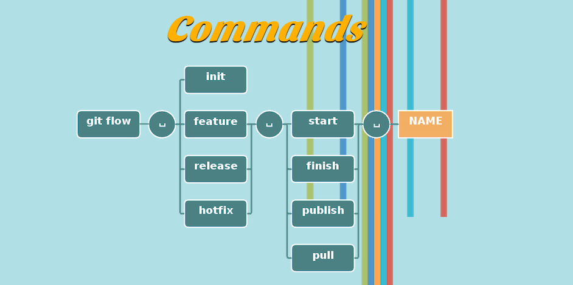

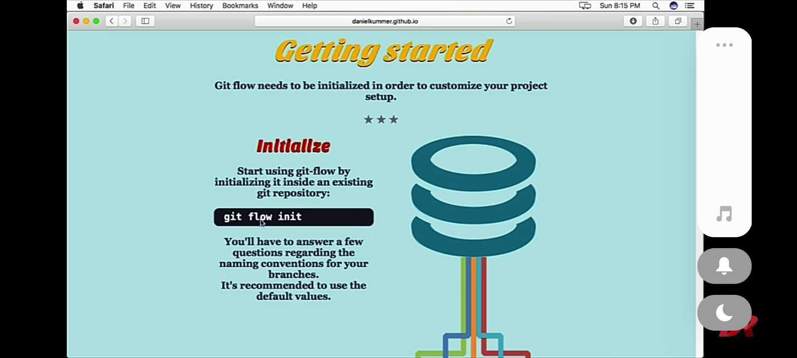

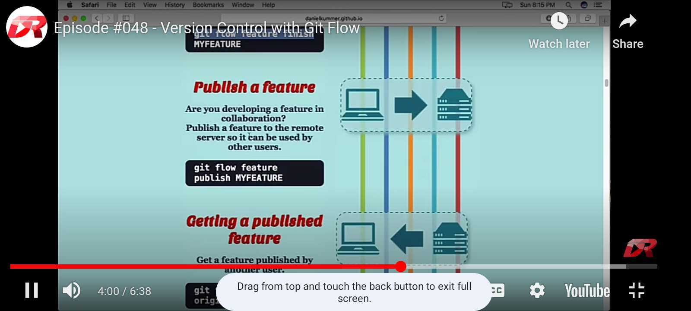

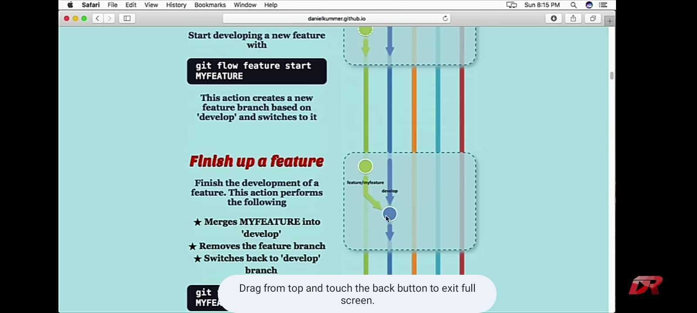

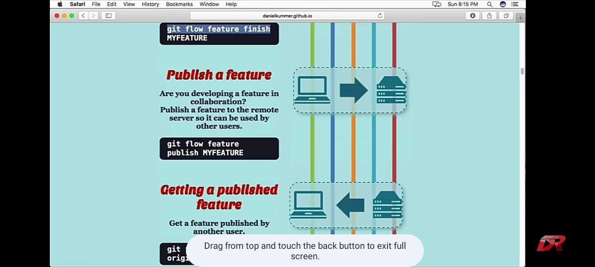

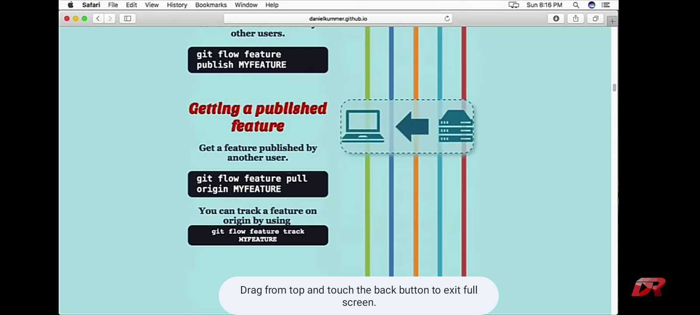

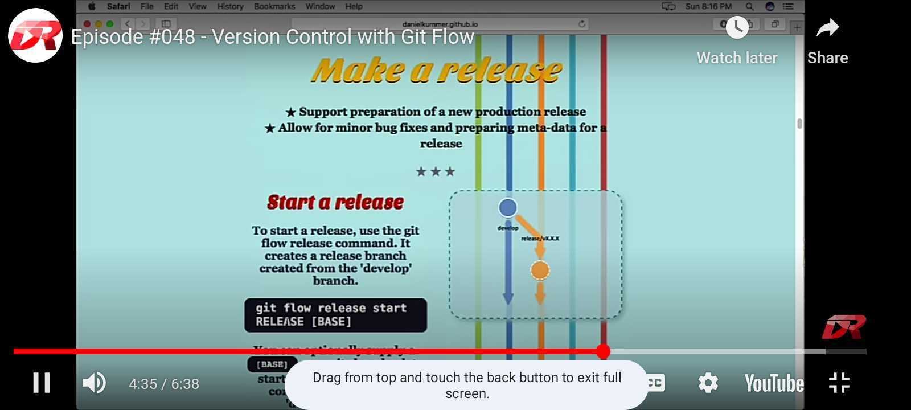

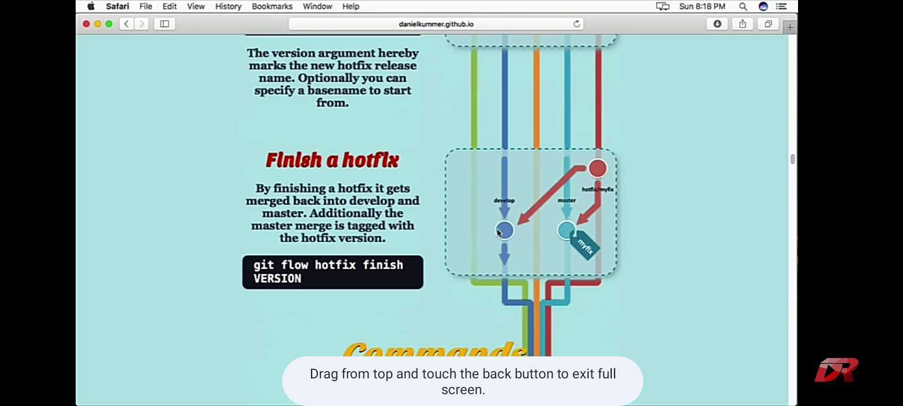

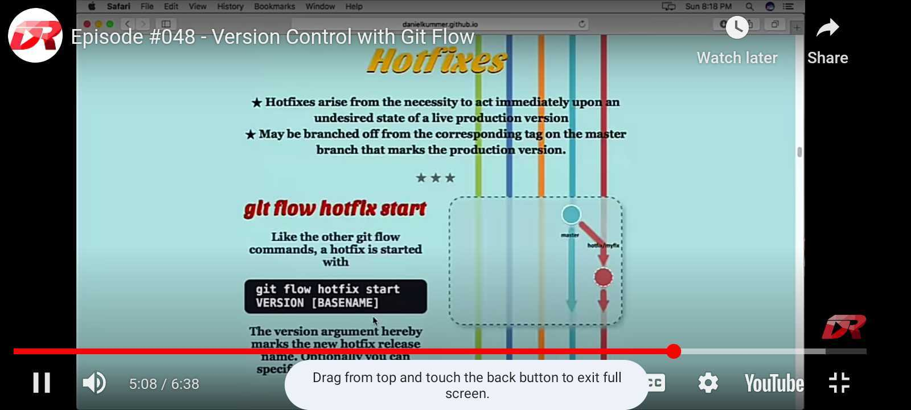

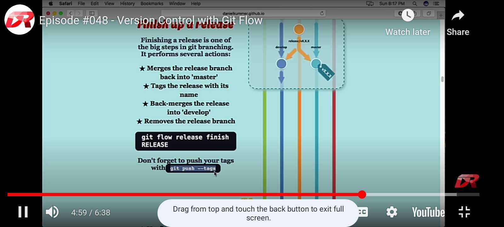

### incase new employ will come to your team how you add the person into the git hub repository

* create githubrepo

* create some private or public repo

* go to that perticular git repo

* click that repo >> in top view we had some settings option click

* in left we get some options access >> collaborators click

* add people >> user already have github account git userid : (mail id ) gives here

### how to manage many users in single laptop

### how to resolve multiple confilcts comes in git repo

* Pull Latest Changes:

Before making any changes, ensure you have the latest changes from the remote repository. Use git pull to fetch and merge the latest changes into your local branch.
Identify Conflicts:

When you encounter conflicts, VSCode will indicate them in the source code files. Conflicts typically appear between <<<<<<< HEAD, =======, and >>>>>>> <branch-name> markers.
*
* Open the File:

Navigate to the conflicted file in VSCode. Click on it to open it in the editor.
Resolve Conflicts:

* Inside the conflicted file, VSCode provides a user-friendly interface for resolving conflicts. You can:
Manually edit the conflicting sections, keeping the changes you want to keep and removing the rest.
Use the built-in Merge Conflict Resolution tool provided by VSCode to accept incoming or current changes selectively.
Choose to accept either all changes from one side or the other.

* Save Changes:

Once you've resolved the conflicts, save the file.
Stage Changes:

After resolving conflicts in all files, stage the changes using git add <file> or git add . if resolving conflicts in multiple files.

* Commit Changes:

Commit the resolved changes with a descriptive commit message using git commit.
Push Changes:

Finally, push the changes to the remote repository using git push.
Test Changes:

After resolving conflicts and pushing changes, ensure that the application still functions as expected. You may need to run tests or perform manual testing depending on your project's workflow.
Communicate:

Communication is key, especially in a team setting. If you encounter conflicts that require input from other team members, reach out to them for clarification or collaboration.
By following these steps and leveraging the features provided by VSCode, you can efficiently resolve conflicts in a Git repository within an organizational context while maintaining code integrity and collaboration.

### in github accounts i want to use two or more github accounts in a one system(lap) 

*  goto the controle panel in our system >> click and open controle panel

*  we see multiple options >> user accounts >> click

*  goto the credentials manage >> click

*  windows creadentials >> click

*  git:https://github.com >> click  (you will shows the github account credentials )

*  then open the terminal and  create .ssh-key

*  for each account you give that ssh-key >>>  ssh-keygen -t rsa -b 4096 -C "hemuchaitu203@outlook.com"

[referlinkhere](https://medium.com/@gperakis/how-to-manage-multiple-github-accounts-on-one-machine-4901bd4332df)

### Jenkins

     installations and sonarqube scanner for quality gate testing

### Vagrant
     
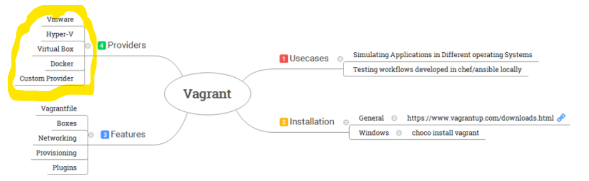

### Vagrantfile:
# pending topic

    A Vagrantfile is a configuration file for controlling virtual machine.
    It uses simple ruby syntax Refer here
    It contains all the necessary information needed for other user who wants to recreate the same vm
    If the user needs to recreate the virtual machine created, then only Vagrantfile is shared

### Boxes

    Boxes are the package format for Vagrant
    Boxes can be easily downloaded by using vagrant box add command
    Publicly available boxes are shared here .
    Every Box is restricted to run on supported providers. So while choosing the box check whether it matches your Provider(VirtualBox/Hyper-V/VmWare)

### Networking

    Vagrant supports 3 main types of networking
    *  Public Networking
    *  Private Networking
    *  Port-Forwarding

        *  Port-forwarding is the action of linking a port on your host machine to a port on the guest machine. Refer here

        * Private Networking_ allows the virtual machine to be accessed via private address. Refer here

        *  Public Networking attempts to allow public access from outside your host machine (if your provider and machine will allow it) instead of just allowing access from inside the host machine. 

### Provisioning

Provisioning offers you the way to configure the virtual machine by executing Scripts or configurations. 

Provisioning happens in the following cases

* Executing         vagrant up command for the first time
* Executing         vagrant provision command
* Executing         vagrant reload --provision command

###  Plugins

* you want to change the way Vagrant does something or add additional          functionality to Vagrant. This can be done via Vagrant plugins.
* Vagrant CLI

##        Packer

* Packer is a tool to create identical/similar machines for multiple platforms from a single source configuration

            sudo apt-get install unzip
            Download packer
            wget https://releases.hashicorp.com/packer/1.3.3/packer_1.3.3_linux_amd64.zip
            # extract packer
            unzip packer_1.3.3_linux_amd64.zip -d packer
            # move extracted folder to /usr/local
            sudo mv packer /usr/local/
            export PATH="$PATH:/usr/local/packer"
            source /etc/environment
            packer --help

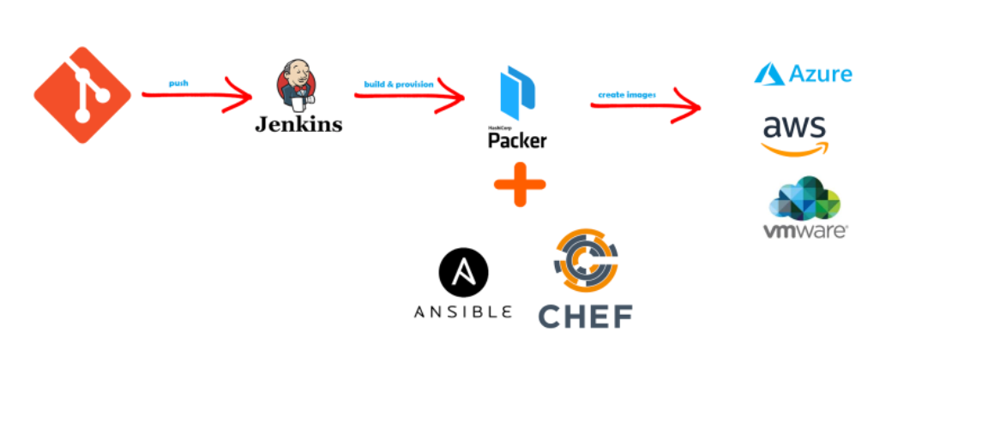

## Terraform

### What is Terraform Backend ?

A "backend" is how the terraform state file is loaded & how apply get’s executed

Default "backend" is local so the .tfstate file gets stored locally.

But when you are working in a team, it makes sense to have the state file (.tfstate) stored at remote location.

### The remote backend supports the following Terraform commands:

 terraform (init ; fmt ; plan ;apply ; fmt ; graph; import; console ; deploy ; show ; providers; taint ; untaint ; validate ; version ; workspace ; state ; output )

 The following standard backends are currently supported by terraform.

           * artifactory  (does not support backend )
           
           * azurerm    (This backend supports state locking and consistency  checking with Azure Blob Storage native capabilities.)

           * consul
           (Stores the state in the Consul KV store at a given path.

            This backend supports state locking.)

           * etcd (The etcd backend is deprecated and will be removed in a future Terraform release. this backend does not supports statelocking)

           * etcdv3 (The etcdv3 backend is deprecated and will be removed in a future Terraform release.Stores the state in the etcd KV store with a given prefix.This backend supports state locking.)

           * gcs 
           (Stores the state as an object in a configurable prefix in a pre-existing bucket on Google Cloud Storage (GCS). The bucket must exist prior to configuring the backend.

            This backend supports state locking.)

           * s3 
           (his backend also supports state locking and consistency    checking via Dynamo DB, which can be enabled by setting the dynamodb_table field to an existing DynamoDB table name. A single DynamoDB table can be used to lock multiple remote state files.)

### What is state locking

When multiple people in the team are trying to use terraform in parallel, then to allow only one user to make changes to the resources can be given by state locking

### Terraform S3 Backend & State Locking with AWS S3 & DynamoDb

To demonstrate backend & i would be using a very simple template which creates a network which can be found here
Create a S3 bucket and note the name
Create a dynamo db table in aws with LockID key of type string
If you dont want to create these manually, There is module which can help you with creation of s3 storage & dynamo db tables. 

## Terraform Workspaces

### What is purpose of Terraform Workspaces

Terraform workspace can be used to create multiple environments. Earlier Terraform used to have concept of environments which was later renamed to worspace.

Terraform has introduced the whole sub-command for managing terraform workspaces. The command looks like

            terraform workspace --help
            
Subcommands:

    delete    Delete a workspace
    list      List Workspaces
    new       Create a new workspace
    select    Select a workspace
    show      Show the name of the current workspace

## Docker

* Docker is a set of platform as a service (PaaS) 

* products that use OS-level virtualization to deliver software in packages called containers.

* The service has both free and premium tiers. The software that hosts the containers is called Docker Engine.

* Docker is a tool that is used to automate the deployment of applications in lightweight containers so that applications can work efficiently in different environments.

* Docker will create two different isolated areas on your OS where we can run our applications. By the way this isolated area is called as Container

* Your applications will still be isolated, as they get the different virtual ip address, different memory spaces etc

* Important Docker is used to isolate individual applications not entire systems, whereas to isolate entire system we would go for hypervisors & create Virtual Machines

### What is Image?

Docker Image is a package with all the dependencies and the necessary information to create the container.

### What is Container?

container is an isolated space for execution of application

### What is Registry?
 
*  Registry is the service which provides access to Docker Images collection.
Docker hub is the default registry.

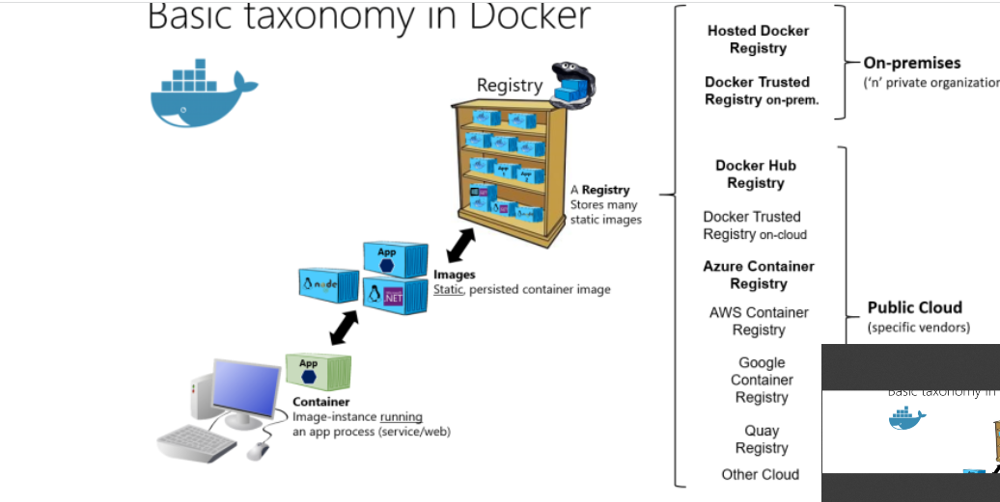

#### docker CLI(command line interface)
### Docker Internals
# pending on directions

## AWS
 
 * Infrastructure as code is a declarative way of managing infrastructure such as networks, virtual machines, storage etc.

* IAC also comes with very important principle idempotance. Idempotance ensures it always sets the target environment to same state for the same configuration.
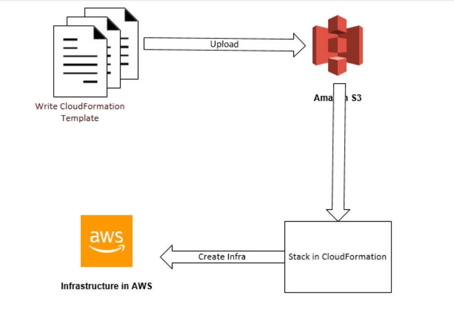

### Stacks:
     All the resources which you manage as a single unit is considered as stack.

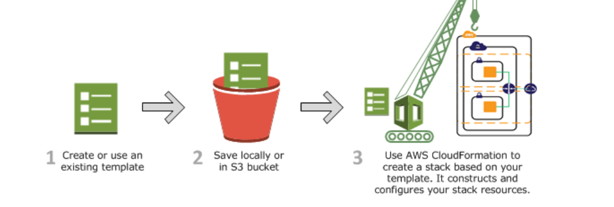

If you observer the section with 3 you can observer stack creating multiple resources

### StackSets:

StackSets allow you to Deploy AWS Resources in multiple regions using a Single CloudFormation Template.

Stacksets creates stack in every region you want to create infra.

If you edit the stackset, then the change will be updated to all the stacks

### Test-Kitchen Setup with AWS
Test Kitchen
# pending

### What is Kitchen

Kitchen is a test harness tool to execute Infrastructure as Code(IaC) on one or more platforms
To execute in multiple platforms kitchen have a driver plugin architecture

Here are common Git commands used by DevOps engineers in their day-to-day activities:

*Basic Git Commands*

1. `git init` - Initialize a Git repository.

Example: `git init my-project`

1. `git clone` - Clone a repository.

Example: `git clone (link unavailable)

1. `git add` - Stage changes.

Example: `git add .`

1. `git commit` - Commit changes.

Example: `git commit -m "Initial commit"`

1. `git log` - View commit history.

Example: `git log --oneline`

1. `git status` - Check repository status.

Example: `git status`

1. `git branch` - Create/manage branches.

Example: `git branch feature/new-feature`

1. `git checkout` - Switch branches.

Example: `git checkout feature/new-feature`

1. `git merge` - Merge branches.

Example: `git merge feature/new-feature`

1. `git remote` - Manage remote repositories.

Example: `git remote add origin (link unavailable)

*Git Workflow Commands*

1. `git pull` - Pull changes from remote repository.

Example: `git pull origin master`

1. `git push` - Push changes to remote repository.

Example: `git push origin master`

1. `git fetch` - Fetch changes from remote repository.

Example: `git fetch origin`

1. `git rebase` - Rebase changes.

Example: `git rebase master`

1. `git tag` - Create/delete tags.

Example: `git tag -a v1.0 -m "Release 1.0"`

*Git Troubleshooting Commands*

1. `git diff` - View changes.

Example: `git diff`

1. `git reset` - Reset changes.

Example: `git reset --hard`

1. `git clean` - Remove untracked files.

Example: `git clean -fd`

1. `git stash` - Stash changes.

Example: `git stash`

1. `git cherry-pick` - Apply specific commits.

Example: `git cherry-pick <commit-hash>`

*Git DevOps Commands*

1. `git submodule` - Manage submodules.

Example: `git submodule add (link unavailable)

1. `git hooks` - Manage Git hooks.

Example: `git hooks --install`

1. `git bisect` - Find bugs.

Example: `git bisect start`

1. `git archive` - Create archives.

Example: `git archive -o archive.zip master`

1. `git filter-branch` - Rewrite commit history.

Example: `git filter-branch --tree-filter 'rm -rf unwanted-file' HEAD`

*CI/CD Pipeline Git Commands*

1. `git clone --depth 1` - Shallow clone.

Example: `git clone --depth 1 (link unavailable)

1. `git checkout --force` - Force checkout.

Example: `git checkout --force ${CI_COMMIT_SHA}`

1. `git pull --ff-only` - Fast-forward pull.

Example: `git pull --ff-only origin ${CI_COMMIT_BRANCH}`

1. `git push --set-upstream` - Push with upstream.

Example: `git push --set-upstream origin ${CI_COMMIT_BRANCH}`

1. `git rev-parse` - Parse Git revisions.

Example: `git rev-parse ${CI_COMMIT_SHA}`

Note: These commands are not exhaustive, but they cover most common use cases.

Would you like more information on Git or DevOps practices?

