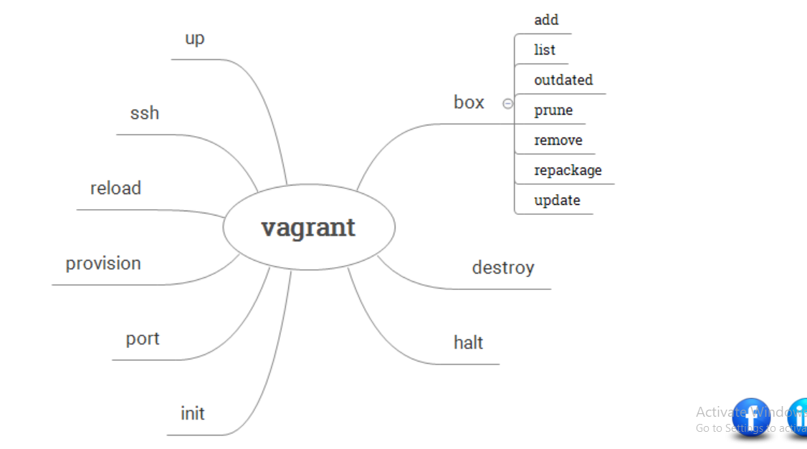

## VCS
    two types of vcs are present
    (1) centralized: SVN , CVS , perforces ,TFS  etc...
    (2) distributed: git , mercurial ,fossil
        * no single point of failure , every developer  has local repository .
        * performanc eis more
        * wihout network also developer contines his work , 
### Git: global information trader
 * git is a distributed  vcs , git is developed by 'linus torvalds'

### branching stratagy

    The git flow branching strategy is very effective branching strategy for the projects. If the project under development needs to support the older releases made then the git flow can be extended with support branches For the support branches i have found useful resource

### Jenkins

     installations and sonarqube scanner for quality gate testing

### Vagrant
     

### Vagrantfile:
# pending topic

    A Vagrantfile is a configuration file for controlling virtual machine.
    It uses simple ruby syntax Refer here
    It contains all the necessary information needed for other user who wants to recreate the same vm
    If the user needs to recreate the virtual machine created, then only Vagrantfile is shared

### Boxes

    Boxes are the package format for Vagrant
    Boxes can be easily downloaded by using vagrant box add command
    Publicly available boxes are shared here .
    Every Box is restricted to run on supported providers. So while choosing the box check whether it matches your Provider(VirtualBox/Hyper-V/VmWare)

### Networking

    Vagrant supports 3 main types of networking
    *  Public Networking
    *  Private Networking
    *  Port-Forwarding

        *  Port-forwarding is the action of linking a port on your host machine to a port on the guest machine. Refer here

        * Private Networking_ allows the virtual machine to be accessed via private address. Refer here

        *  Public Networking attempts to allow public access from outside your host machine (if your provider and machine will allow it) instead of just allowing access from inside the host machine. 

### Provisioning

Provisioning offers you the way to configure the virtual machine by executing Scripts or configurations. 

Provisioning happens in the following cases

* Executing         vagrant up command for the first time
* Executing         vagrant provision command
* Executing         vagrant reload --provision command

###  Plugins

* you want to change the way Vagrant does something or add additional          functionality to Vagrant. This can be done via Vagrant plugins.
* Vagrant CLI

##        Packer

* Packer is a tool to create identical/similar machines for multiple platforms from a single source configuration

            sudo apt-get install unzip
            Download packer
            wget https://releases.hashicorp.com/packer/1.3.3/packer_1.3.3_linux_amd64.zip
            # extract packer
            unzip packer_1.3.3_linux_amd64.zip -d packer
            # move extracted folder to /usr/local
            sudo mv packer /usr/local/
            export PATH="$PATH:/usr/local/packer"
            source /etc/environment
            packer --help

## Terraform

### What is Terraform Backend ?

A "backend" is how the terraform state file is loaded & how apply get’s executed

Default "backend" is local so the .tfstate file gets stored locally.

But when you are working in a team, it makes sense to have the state file (.tfstate) stored at remote location.

### The remote backend supports the following Terraform commands:

 terraform (init ; fmt ; plan ;apply ; fmt ; graph; import; console ; deploy ; show ; providers; taint ; untaint ; validate ; version ; workspace ; state ; output )

 The following standard backends are currently supported by terraform.

           * artifactory  (does not support backend )
           
           * azurerm    (This backend supports state locking and consistency  checking with Azure Blob Storage native capabilities.)

           * consul
           (Stores the state in the Consul KV store at a given path.

            This backend supports state locking.)

           * etcd (The etcd backend is deprecated and will be removed in a future Terraform release. this backend does not supports statelocking)

           * etcdv3 (The etcdv3 backend is deprecated and will be removed in a future Terraform release.Stores the state in the etcd KV store with a given prefix.This backend supports state locking.)

           * gcs 
           (Stores the state as an object in a configurable prefix in a pre-existing bucket on Google Cloud Storage (GCS). The bucket must exist prior to configuring the backend.

            This backend supports state locking.)

           * s3 
           (his backend also supports state locking and consistency    checking via Dynamo DB, which can be enabled by setting the dynamodb_table field to an existing DynamoDB table name. A single DynamoDB table can be used to lock multiple remote state files.)

### What is state locking

When multiple people in the team are trying to use terraform in parallel, then to allow only one user to make changes to the resources can be given by state locking

### Terraform S3 Backend & State Locking with AWS S3 & DynamoDb

To demonstrate backend & i would be using a very simple template which creates a network which can be found here
Create a S3 bucket and note the name
Create a dynamo db table in aws with LockID key of type string
If you dont want to create these manually, There is module which can help you with creation of s3 storage & dynamo db tables. 

## Terraform Workspaces

### What is purpose of Terraform Workspaces

Terraform workspace can be used to create multiple environments. Earlier Terraform used to have concept of environments which was later renamed to worspace.

Terraform has introduced the whole sub-command for managing terraform workspaces. The command looks like

            terraform workspace --help
            
Subcommands:

    delete    Delete a workspace
    list      List Workspaces
    new       Create a new workspace
    select    Select a workspace
    show      Show the name of the current workspace

## Docker

* Docker is a set of platform as a service (PaaS) 

* products that use OS-level virtualization to deliver software in packages called containers.

* The service has both free and premium tiers. The software that hosts the containers is called Docker Engine.

* Docker is a tool that is used to automate the deployment of applications in lightweight containers so that applications can work efficiently in different environments.

* Docker will create two different isolated areas on your OS where we can run our applications. By the way this isolated area is called as Container

* Your applications will still be isolated, as they get the different virtual ip address, different memory spaces etc

* Important Docker is used to isolate individual applications not entire systems, whereas to isolate entire system we would go for hypervisors & create Virtual Machines

### What is Image?

Docker Image is a package with all the dependencies and the necessary information to create the container.

### What is Container?

container is an isolated space for execution of application

### What is Registry?
 
*  Registry is the service which provides access to Docker Images collection.
Docker hub is the default registry.

#### docker CLI(command line interface)
### Docker Internals
# pending on directions

## AWS
 
 * Infrastructure as code is a declarative way of managing infrastructure such as networks, virtual machines, storage etc.

* IAC also comes with very important principle idempotance. Idempotance ensures it always sets the target environment to same state for the same configuration.

### Stacks:
     All the resources which you manage as a single unit is considered as stack.

If you observer the section with 3 you can observer stack creating multiple resources

### StackSets:

StackSets allow you to Deploy AWS Resources in multiple regions using a Single CloudFormation Template.

Stacksets creates stack in every region you want to create infra.

If you edit the stackset, then the change will be updated to all the stacks

### Test-Kitchen Setup with AWS
Test Kitchen
# pending

### What is Kitchen

Kitchen is a test harness tool to execute Infrastructure as Code(IaC) on one or more platforms
To execute in multiple platforms kitchen have a driver plugin architecture.

#

